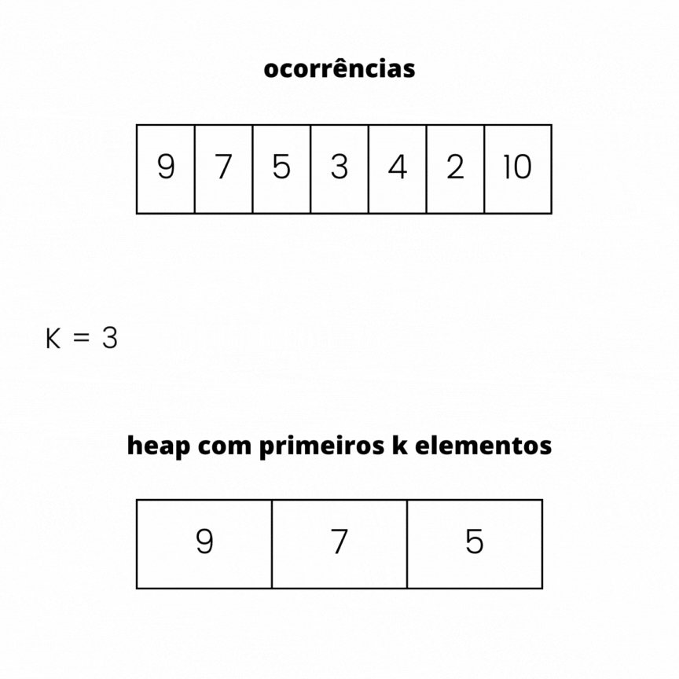
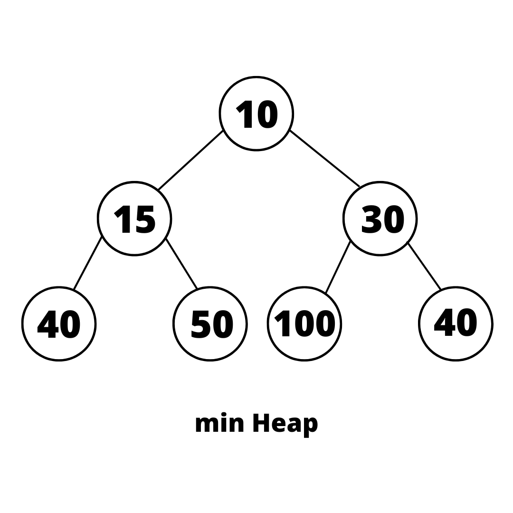
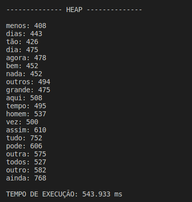

# **Top K Elementos**

Atividade para a disciplina de Algoritmos e Estruturas de Dados II. <br/>

## Sumário 📕 

- [Objetivos](#Objetivos)
- [Estrutura](#Estrutura)
- [Diretrizes](#Diretrizes)
- [Decisões de Implementação](#Decisões_de_Implementação)
- [Funções](#Funções)
- [Resultados](#Resultados)
- [Tempo de execução e Custo computacional](#Tempo_de_execução_e_Custo_computacional)
- [Conclusão](#Conclusão)
- [Compilação e execução](#Compilação-e-execução)
- [Referências](#Referências)

## Objetivo 🎯 

O objetivo é desenvolver um algoritmo utilizando-se tabela hash e o método heap para resolver um problema clássico chamado "Top K itens". 
Neste tipo de problema é preciso encontrar os K itens mais valiosos de uma coleção de dados. Logo, utiliza-se o hash para contar a frequência de todos os itens, enquanto o heap se aplica na manutenção de uma lista dos K itens de maior valor. 

## Estrutura 🗂️

- ```topk.hpp:``` Engloba a struct WordInfo, todas as funções utilizadas e seus parâmetros.
- ```topk.cpp:``` Contém a criação e o desenvolvimento de todas as funções do código.    
- ```main.cpp:``` Pertence a parte de leitura dos arquivos, chamada das funções usadas e o tempo de execução do programa.
- ```include.hpp:``` Inclui biliotecas e arquivos a serem utilizados.
- ```text1.txt:``` Texto de entrada. 
- ```text2.txt:``` Texto de entrada. 
- ```stopwords.txt:``` Artigos e conjunções como (a, o, as, os, e, ou).

## Diretrizes ☑️ 

As especificações a seguir foram propostas para discussão do problema:

- A partir de um texto de entrada, o algoritmo realiza a leitura dele e cria uma tabela de dispersão (hash) intitulada ```glossary```, para contar quantas vezes cada palavra aparece no texto. A chave do hash é a própria palavra.
- O conteúdo do arquivo de stopWords, que podem ser alteradas de acordo com a preferência do usuário, é salvo em outra tabela de dispersão. As stopWords que forem econtradas no texto, são em seguida excluídas dele. Pois, por serem artigos e conjunções facilmente seriam as mais frequentes do heap, no entanto foram desconsideradas.
- Em seguida, a partir de um valor K, é inserido em um vetor intitulado ```heap``` as primeiras K palavras guardadas no hash e depois são organizadas de forma que a menor ocorrência das K palavras inseridas, esteja na primeira posição do vetor.
- Após isso para cada elemento restante na hash, é realizado comparações com o menor valor contido no heap, que neste caso são as ocorrências:

  1. Se a ocorrência for maior do que o menor valor da heap, o menor valor é removido, o novo elemento é inserido e a estrutura novamente organizada.
  2. Caso contrário, o elemento deve ser ignorado, e é comparado o próximo dado até o fim do glossário.
- No final, a heap conterá os K elementos com maiores valores (ocorrências) dentre os textos lidos. 

<div style="display: flex; justify-content: center;">
    
</div>

- Este programa deverá ler uma coleção de arquivos contento textos sem nenhuma formatação ("arquivo ASCII") onde cada sentença termina por um sinal de pontuação (".", "?", "!"").
- Cada parágrafo é separado por, pelo menos, uma linha em branco.
- Considere como palavra uma sequência de letras delimitada por espaço em branco, ”coluna da esquerda”, ”coluna da direita” e símbolos de pontuação.

- Todos os arquivos de entrada são lidos caracter por caracter.

- O programa permite a leitura de vários arquivos de texto ao mesmo tempo, no entanto existem algumas regras:
  1. Para cada novo arquivo que se deseja ler, deve ser colocado dentro da pasta ```data```. 
  2. O nome dos arquivos de texto seguem um padrão de "text1.txt" (1° arquivo), "text2.txt"(2° arquivo) e assim sucessivamente, logo devem ser renomeados. 
  3. Além disso, a variável ```FILES``` dentro do ```include.hpp``` guarda a quantidade de arquivos a serem lidos, portanto, modifique para a quantidade desejada.

- Dentro do arquivo ```include.hpp``` possui a variável K que corresponde ao tamanho do heap, também pode ser alterada.

## Decisões de implementação 📝

```unordered_map:``` Emprega uma tabela de hash para associar chaves a valores. As chaves são identificadores diretos para os dados, e, nesse caso, essas chaves correspondem às palavras. Cada valor é armazenado na forma de uma struct denominada WordInfo, a qual armazena as ocorrências. É importante observar que o unordered_map, os elementos ordenados. 

Esse algoritmo trata colisões, pela implementação do libstdc++, por exemplo, utiliza uma técnica de encadeamento linear. Enquanto outras implementaçõe podem adotar diferentes estratégias. A biblioteca padrão C++ estabelece uma interface que compreende, entre outros recursos, o conceito de bucket_count, que possui uma complexidade de tempo constante. Tal característica indica a aplicação do encadeamento de colisões, onde itens com hashes semelhantes são agrupados em baldes. Este agrupamento facilita a contagem dos elementos por balde de mesmo valor hash, calculados por funções específicas. 

Há funções de hash do GCC C++ utilizadas, que usam implementação de "MurmurHashUnaligned2".  O nome do algoritmo é derivado das operações que são realizadas em sequência para produzir o hash: multiplicação e rotação. Murmur faz parte funções de hash de uso geral, adequadas para uso não criptográfico e que garante não ter colisões para chaves de 4 bytes.
o algoritmo MurmurHash gera um valor hash único para um bloco de dados fornecido. A função itera pelo bloco de dados em segmentos de 32 bits e realiza cálculos para cada segmento.

No entanto, cada compilador de C++ deve implementar a biblioteca padrão por qualquer meio que optar. Geralmente é chamada a biblioteca padrão inspiradas no STL.
No entanto, é essencial compreender que diferentes compiladores de C++ podem optar por implementar a biblioteca padrão de maneiras diversas, ainda que sejam geralmente influenciados pela abordagem do STL. 

- Melhor caso: $O\;(1)$
- Pior caso:  $O\;(n)$


```Heap:``` Uma heap é uma árvore binária onde o valor de cada nó é maior (ou menor) do que os valores de seus nós filhos, dependendo se é uma max-heap ou min-heap. Nesse caso, o algoritmo implementa uma min-heap, e cada nó tem um valor menor ou igual ao valor de seus filhos, mantendo o menor elemento na primeira posição. O valor a ser armazenado nessa estrutura são as maiores ocorrências de palavras no texto.

<div style="text-align:center">
    
</div>

O heap é organizado da seguinte forma:

- Verifica se o nó à esquerda existe e se o valor de ocorrências desse nó é menor que o valor de ocorrências do nó atual. Se essa condição for verdadeira, atualiza largest para apontar para o nó à esquerda.
- A função faz a mesma verificação para o nó da direita. 

Quando se encontra um nó filho com valor menor que o atual, a troca entre os elementos ocorre e função é chamada novamente de modo recursivo.
A condição de parada ocorre quando o atual é maior do que seus nós filhos.

As trocas são feitas usando a função ```swap```, que aceita dois parâmetros que serão trocados. Os parâmetros podem ser de qualquer tipo de dados.
A função não retorna nada, apenas troca os valores, que nesse caso se refere a troca de uma ocorrência menor pela outra maior.

Custo: $O\;n\;(log \;  n)$, onde n é o tamanho da coleção de dados e k o número de itens mais relevantes.

De modo geral, o custo computacional é:

- Para percorrer todos os elementos do hash  $O(n)$ <br> 
- Para percorrer todos os elementos do heap  $O\;k\;(log   k)$


 ## Funções  💻

- ```addStopWord``` : Adiciona as stop words no glossário destinado para elas.
- ```existentWord```: Verifica as stop words presentes no glossário e remove elas dele.
- ```manyFiles```: Guarda o nome dos arquivos dos textos de entrada em um vector.
- ```printGlossary``` : Imprimi o glossário de palavras de ambos os textos juntos.
- ```fileReading``` : Realiza leitura caracter por caracter dos textos de entrada, utilizando um switch case, essa função processa, identifica as palavras e adiciona cada uma no glossário.
- ```cases``` : Realiza a contagem de ocorrência de cada palavra a medida que o texto é lido.
- ```Accentuation``` : Procedimento que trata palavras acentuadas para aparecerem corretamente.
- ```removeErro``` : Exclui possíveis strings vazias do glossário.
- ```insertK``` : Insere os primeiros K elementos do hash no heap.
- ```printHeap``` : Imprimi o heap de forma crescente.
- ```finaleHash``` : Realiza inserção do restante dos itens do hash, a partir da posição K, insere ou troca as maiores ocorrências do hash com o menor do heap.
- ```heapify``` : Responsável por garantir que o valor no nó seja maior ou igual aos valores de seus filhos. 
- ```heapSort``` : Ordena o heap de maneira crescente.

 ## Tempo de execução e Custo Computacional 🕜

A contagem foi feita pelas ferramentas disponibilizadas pela bibioteca "time.h". <br/>
A média geral do tempo de execução deste código é: 491,123 ms

Unordered_map: Melhor caso: O(1)
               Pior caso O(n)
               O(1) para a busca, remoção e inserção de elementos no
melhor caso, e O(n) no pior caso.

Heap:

O(n) → para percorrer as palavras do texto
O(k * log k) → para inserir os k primeiro itens
O( (n-k) * log k) → para tentar inserir o restante dos elementos na heap
O(k) → para exibir os K itens

## Resultados ✅

Ao final da execução é mostrado o heap com as palavras que contém maiores ocorrências da coleção de dados.
A ordem das ocorrências seguem a estrutura de um heap.
<div style="text-align:center">
    
</div>

## Conclusão 📋

Ao realizar o projeto "Top K itens", foi possível explorar técnicas de programação utilizando estruturas como o tabela hash e o método heap.
Esse algoritmo é uma combinação eficiente do uso de hash para contar a frequência dos elementos e heap para manter a lista dos K elementos com maiores valores.
Ao combinar as capacidades de contagem rápida de hash e a capacidade de manutenção de ordem e seleção eficiente de heap, o algoritmo consegue atingir um desempenho notável em termos de complexidade temporal para uma grande entrada de dados, já que para a busca dos K maiores itens não é necessário percorrer todo o heap procurando o menor valor, uma vez que ele estará sempre na primeira posição.


## Compilação e Execução  👾

Esse pequeno exemplo possui um arquivo Makefile que realiza todo o procedimento de compilação e execução. <br/>Para tanto, temos as seguintes diretrizes de execução:


| Comando                |  Função                                                                                           |                     
| -----------------------| ------------------------------------------------------------------------------------------------- |
|  `make clean`          | Apaga a última compilação realizada contida na pasta build                                        |
|  `make`                | Executa a compilação do programa utilizando o gcc, e o resultado vai para a pasta build           |
|  `make run`            | Executa o programa da pasta build após a realização da compilação                                 |

## Referências 

https://learn.microsoft.com/pt-br/cpp/standard-library/unordered-map-class?view=msvc-170
https://stackoverflow.com/questions/21518704/
https://stackoverflow.com/questions/19411742/
https://www.geeksforgeeks.org/heap-data-structure/
https://www.geeksforgeeks.org/swap-in-cpp/

### Contato

<div>
 <br><p align="justify"> Anna Laura Moura Santana</p>
 <a href="https://t.me/annalaurams">
  
 </div>
<a style="color:black" href="mailto:nalauramoura@gmail.com?subject=[GitHub]%20Source%20Dynamic%20Lists">
✉️ <i>nalauramoura@gmail.com</i>
</a>